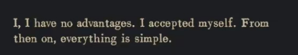
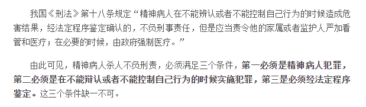

加缪在他的手记中写到

某种意义上，我也似乎是一个偏向加缪的人，但是不如加缪坦诚。

大多数时候是在在乎和不在乎之间摇摆不停，在乎的人咬定不放，有些坚持下去，有些失败了就颓废起来，落到现在就是我这个样子，不在乎的人有着某种脱离的特性，特别不在乎的就是特别脱离，有些优秀者就在精神病医院里面获得了杀人不犯法的优秀资格

有些时候我有略微的冲动，但是很快就压抑下去，在心里不断哮喘，有些事物就是这样点燃以后堵在你心里，你开口的时候只有哑然，冬天的时候这些东西又顺着白色烟雾逃出去

我决心每天乱写，不至于太过失落